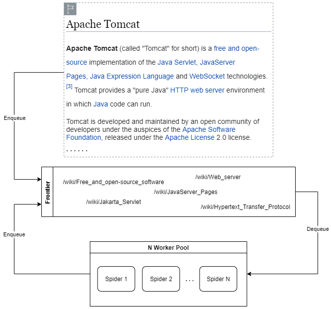

# wiki-spider-core

### Overview

Package containing the core definitions for `wiki-spider`. 
Ever wondered how many pages or "steps" it takes to get from
one Wikipedia page _A_ to Wikipedia page _B_? This pet project
is an exploration of that question, where a `wiki-spider` by our
definition is simply a web-crawler whose goal is to find _any_
(not the shortest) path between Wikipedia pages _A_ and _B_.

The current implementation is naive. It is a simple BFS on Wikipedia
URLs from a source Wikipedia page _A_, which orchestrates multiple
instances of `wiki-spider`s on _N_ threads. Since the only implementation
currently is thread-based, everything operates in-memory. But in the future,
if time permits, abstracting to a generic worker-based implementation
would be cooler. This would allow for more flexible worker definitions, where
workers could be spread across multiple hosts (thus different IPs, thus less
connection delay preventing tripping Wikipedia's DDoS protection).

### Design

Below is a very high-level overview of the general worker pattern used, where
the _frontier_ is the pool of nodes that need to be visited. More details on
parallelized BFS is well-described on this 
[wiki](https://en.wikipedia.org/wiki/Parallel_breadth-first_search).



### Example Usage

```java
class Example {

    public static void main(final String[] args) throws Exception {
        final String start = "/Apache_Tomcat";
        final String target = "/Microsoft";
        
        final Future<List<WebNode>> result = SearchProvider.inMemoryWikiSearch(
                start,  // start page: https://en.wikipedia.org/wiki/Apache_Tomcat
                target, // target page: https://en.wikipedia.org/wiki/Microsoft
                5,      // num threads
                50,     // max chances per "epoch" (per worker attempt)
                500     // ms connection grace period
        );
        
        log.info("Result path: {}", result.get());
    }
}
```